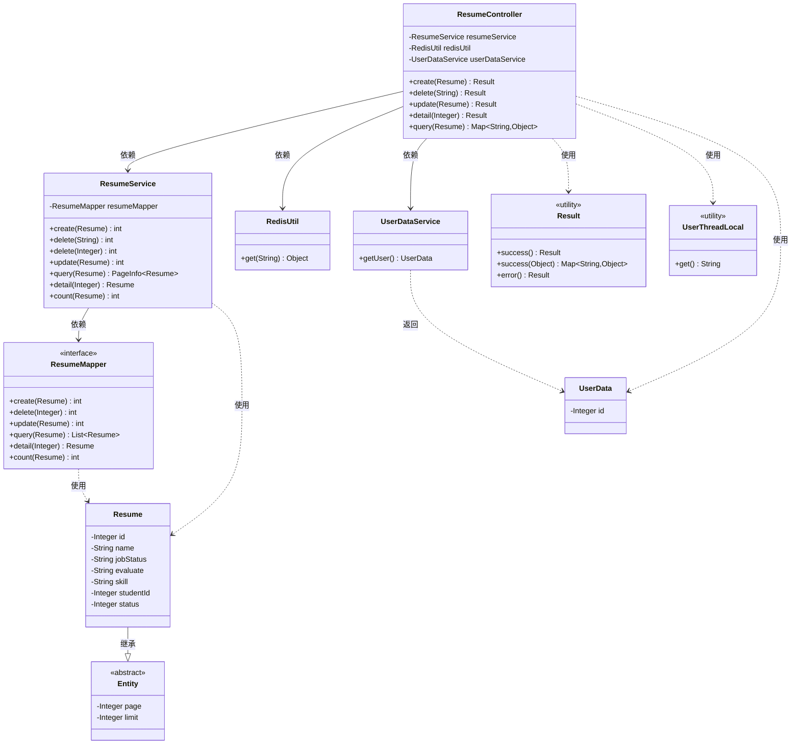

```mermaid
classDiagram
    class ResumeController {
        -ResumeService resumeService
        -RedisUtil redisUtil
        -UserDataService userDataService
        +create(Resume) Result
        +delete(String) Result
        +update(Resume) Result
        +detail(Integer) Result
        +query(Resume) Map~String,Object~
    }

    class ResumeService {
        -ResumeMapper resumeMapper
        +create(Resume) int
        +delete(String) int
        +delete(Integer) int
        +update(Resume) int
        +query(Resume) PageInfo~Resume~
        +detail(Integer) Resume
        +count(Resume) int
    }

    class ResumeMapper {
        <<interface>>
        +create(Resume) int
        +delete(Integer) int
        +update(Resume) int
        +query(Resume) List~Resume~
        +detail(Integer) Resume
        +count(Resume) int
    }

    class Resume {
        -Integer id
        -String name
        -String jobStatus
        -String evaluate
        -String skill
        -Integer studentId
        -Integer status
    }

    class Entity {
        <<abstract>>
        -Integer page
        -Integer limit
    }

    class RedisUtil {
        +get(String) Object
    }

    class UserDataService {
        +getUser() UserData
    }

    class UserData {
        -Integer id
    }

    class Result {
        <<utility>>
        +success() Result
        +success(Object) Map~String,Object~
        +error() Result
    }

    class UserThreadLocal {
        <<utility>>
        +get() String
    }

    ResumeController --> ResumeService : 依赖
    ResumeController --> RedisUtil : 依赖
    ResumeController --> UserDataService : 依赖
    ResumeController ..> Result : 使用
    ResumeController ..> UserThreadLocal : 使用
    ResumeController ..> UserData : 使用
    ResumeService --> ResumeMapper : 依赖
    ResumeService ..> Resume : 使用
    ResumeMapper ..> Resume : 使用
    Resume --|> Entity : 继承
    UserDataService ..> UserData : 返回
```