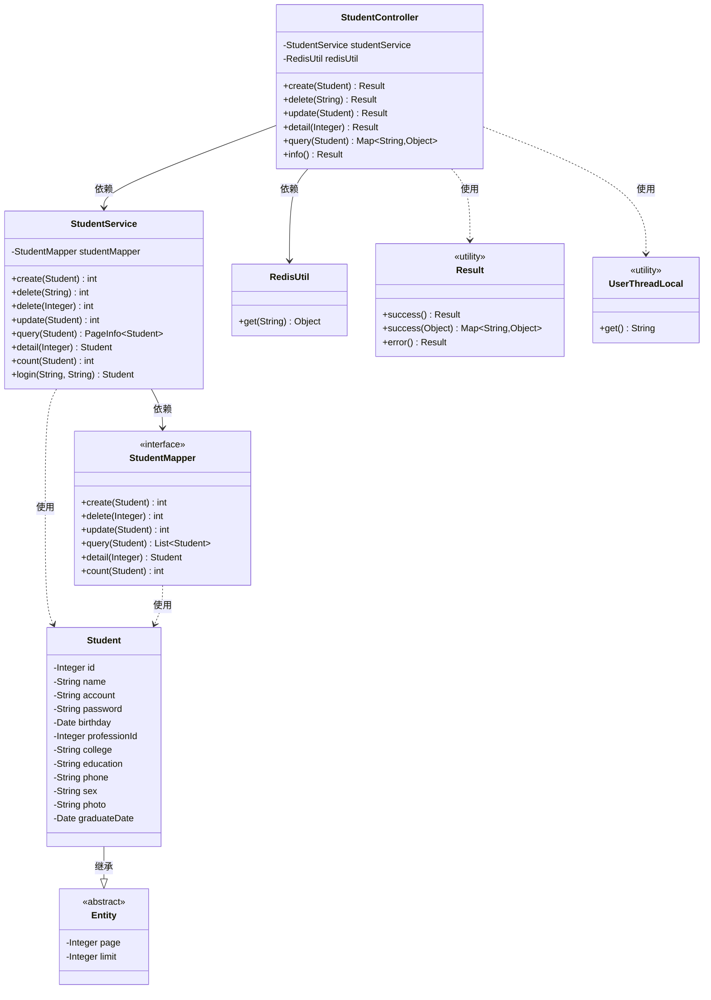

```mermaid
classDiagram
    class StudentController {
        -StudentService studentService
        -RedisUtil redisUtil
        +create(Student) Result
        +delete(String) Result
        +update(Student) Result
        +detail(Integer) Result
        +query(Student) Map~String,Object~
        +info() Result
    }

    class StudentService {
        -StudentMapper studentMapper
        +create(Student) int
        +delete(String) int
        +delete(Integer) int
        +update(Student) int
        +query(Student) PageInfo~Student~
        +detail(Integer) Student
        +count(Student) int
        +login(String, String) Student
    }

    class StudentMapper {
        <<interface>>
        +create(Student) int
        +delete(Integer) int
        +update(Student) int
        +query(Student) List~Student~
        +detail(Integer) Student
        +count(Student) int
    }

    class Student {
        -Integer id
        -String name
        -String account
        -String password
        -Date birthday
        -Integer professionId
        -String college
        -String education
        -String phone
        -String sex
        -String photo
        -Date graduateDate
    }

    class Entity {
        <<abstract>>
        -Integer page
        -Integer limit
    }

    class RedisUtil {
        +get(String) Object
    }

    class Result {
        <<utility>>
        +success() Result
        +success(Object) Map~String,Object~
        +error() Result
    }

    class UserThreadLocal {
        <<utility>>
        +get() String
    }

    StudentController --> StudentService : 依赖
    StudentController --> RedisUtil : 依赖
    StudentController ..> Result : 使用
    StudentController ..> UserThreadLocal : 使用
    StudentService --> StudentMapper : 依赖
    StudentService ..> Student : 使用
    StudentMapper ..> Student : 使用
    Student --|> Entity : 继承
```